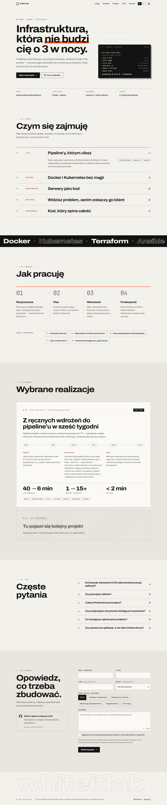

# whiteitlab — strona firmowa

Strona usług DevOps i programistycznych **whiteitlab** (PL + EN) z formularzem zgłoszeniowym wysyłającym e-mail przez SMTP.
Działa jako jeden kontener (distroless, non-root, read-only) za reverse proxy **nginx** na VPS.



## Co tu jest

| Element | Opis |
|---|---|
| Strona | Statyczny HTML generowany z `site/content/{pl,en}.json` — bez frameworka, bez runtime'owego JS-a do renderowania |
| Formularz | `POST /api/contact` → walidacja, honeypot, pułapka czasowa, rate-limit, e-mail przez SMTP (nodemailer) |
| Kontener | Multi-stage, runtime `gcr.io/distroless/nodejs22-debian12:nonroot`, UID 65532, bez shella |
| Proxy | Gotowa konfiguracja nginx: TLS (Let's Encrypt), HSTS, gzip, `limit_req`, przekierowania www/http |
| SEO | JSON-LD (firma, usługi, FAQ), Open Graph z obrazkami, hreflang, sitemap, kompresja brotli — [docs/SEO.md](docs/SEO.md) |
| Testy | `node --test` — walidacja, serwer, SEO (21 testów) |

## Szybki start (lokalnie)

Wymagany Node.js ≥ 22.

```bash
npm install
npm run dev        # build + serwer na http://localhost:8080, formularz w trybie dry-run (nic nie wysyła)
npm test           # testy (wymaga wcześniejszego npm run build)
npm run images     # po zmianie nagłówka/kolorów/domeny: odtwarza obrazki OG i ikony (wymaga Chrome)
```

## Produkcja (VPS)

```bash
cp .env.example .env && chmod 600 .env          # uzupełnij SMTP / adresy
mkdir -p secrets && read -rsp 'Hasło SMTP: ' P && printf %s "$P" > secrets/smtp_pass && unset P
sudo chown 65532:65532 secrets/smtp_pass && sudo chmod 400 secrets/smtp_pass
docker compose up -d --build
```

Pełna procedura (nginx, certyfikat, firewall, aktualizacje, rollback): **[docs/DEPLOYMENT.md](docs/DEPLOYMENT.md)**.

## Struktura

```
.
├── Dockerfile                 # multi-stage → distroless nonroot
├── compose.yaml               # hardening: read_only, cap_drop ALL, no-new-privileges, limity
├── .env.example               # konfiguracja (bez sekretów)
├── deploy/nginx/              # reverse proxy + TLS + konfiguracja startowa pod certbota
├── site/
│   ├── config.json            # domena, GitHub, lista narzędzi w pasku
│   ├── content/pl.json        # ← TU edytujesz teksty (PL)
│   ├── content/en.json        # ← i ich wersję EN
│   ├── page.mjs               # szablony HTML
│   ├── build.mjs              # generator → dist/
│   ├── assets/                # CSS, JS, favicon
│   └── static/                # obrazki OG, ikony PNG, manifest (kopiowane 1:1)
├── server/                    # serwer HTTP + API formularza
├── scripts/dev.mjs            # uruchomienie lokalne
├── scripts/images.mjs         # generator obrazków OG i ikon
├── test/                      # node --test
└── docs/                      # dokumentacja i decyzje
```

## Dokumentacja

- [docs/DECISIONS.md](docs/DECISIONS.md) — **dziennik decyzji (ADR)**: co wybrano, dlaczego i co odrzucono
- [docs/ARCHITECTURE.md](docs/ARCHITECTURE.md) — jak to działa, przepływ żądań
- [docs/DEPLOYMENT.md](docs/DEPLOYMENT.md) — wdrożenie na VPS krok po kroku
- [docs/SECURITY.md](docs/SECURITY.md) — model zagrożeń i lista zabezpieczeń
- [docs/CONTENT.md](docs/CONTENT.md) — edycja treści, podmiana projektów, domena
- [docs/DESIGN.md](docs/DESIGN.md) — system wizualny i uzasadnienie wyglądu
- [docs/SEO.md](docs/SEO.md) — co zrobiono pod SEO, checklista po starcie (Search Console), dalsze kroki

## Do zrobienia przed publikacją

- [ ] **Podmień przykładowy projekt WL-01** na prawdziwy (to realistyczny, ale wymyślony przykład — liczby też). Patrz [CONTENT.md](docs/CONTENT.md).
- [ ] Potwierdź domenę (założono `whiteitlab.pl`) — [CONTENT.md → Domena](docs/CONTENT.md#zmiana-domeny).
- [ ] Zweryfikuj obietnice w hero („odpowiedź zwykle w 1 dzień roboczy”) i widełki budżetu.
- [ ] Uzupełnij klauzulę RODO o pełne dane administratora (imię i nazwisko / firma, adres) lub dodaj politykę prywatności.
- [ ] Ustaw SPF/DKIM/DMARC dla domeny nadawcy `MAIL_FROM`.
- [ ] Zweryfikuj odpowiedzi w FAQ (`faq.items` w obu plikach JSON).
- [ ] Po starcie: Google Search Console + sitemap — [SEO.md → checklista](docs/SEO.md#po-uruchomieniu-produkcji--checklista).
