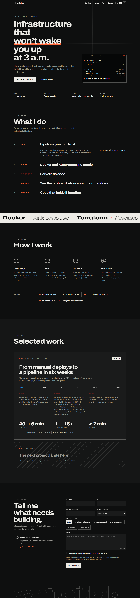

# System wizualny

Uzasadnienie kierunku: [ADR-014](DECISIONS.md#adr-014). Ten plik opisuje, jak system jest zbudowany, żeby dalsze zmiany go nie rozmyły.

| Jasny (PL) | Ciemny (EN) |
|---|---|
|  |  |

## Idea

**„Karta specyfikacji z laboratorium.”** Strona ma wyglądać jak dobrze złożona dokumentacja techniczna, a nie jak landing page z szablonu: siatka, cienkie linie, numeracja, etykiety w monospace, jeden kolor sygnałowy. Charakter dają typografia i rytm, a nie ozdobniki.

Test przy każdej zmianie: *czy ten element mógłby się znaleźć na dowolnej innej stronie firmy IT?* Jeśli tak — przemyśl go jeszcze raz.

## Tokeny (`site/assets/style.css`, `:root`)

| Token | Jasny | Ciemny | Użycie |
|---|---|---|---|
| `--bg` | `#f3f1ec` | `#0e0f0f` | tło strony — złamana biel papieru, nie czysta biel |
| `--bg-2` | `#e9e6df` | `#151616` | tło sekcji „Projekty” |
| `--surface` | `#faf9f6` | `#1a1b1b` | karty, pola formularza |
| `--ink` | `#121212` | `#ecebe6` | tekst, przyciski |
| `--ink-2` | `#55544f` | `#9c9b95` | tekst drugorzędny |
| `--line` / `--line-strong` | ink 14% / 32% | ink 13% / 30% | linie siatki i podziały |
| `--acc` | `#ff4f1a` | `#ff6a3d` | **jedyny** kolor akcentu — oszczędnie |
| `--acc-text` | `#b93a0b` | `#ff6a3d` | akcent dla **małego tekstu** (etykiety, numery) — `#ff4f1a` ma na jasnym tle tylko 2.9:1 |
| `--ok` | `#1f8a4c` | – | status „przyjmuję zlecenia” |

Zasada: akcent pojawia się jako **sygnał** (numer, etykieta, pasek postępu, podkreślenie), nigdy jako duże tło. Wyjątek: wypełnienie przycisku przy hover.

## Typografia

- **Archivo** (variable, oś `wdth` 62–125%) — cały tekst. Nagłówki: waga 700–750, `font-stretch` 106–125%, `letter-spacing` ujemny. Szerokość fontu to główne narzędzie ekspresji (stopka 125%, marquee 125%, nagłówki ~110%).
- **JetBrains Mono** — tylko etykiety, numery, metadane, terminal. Małe (0.72–0.78rem), często uppercase.
- Rozmiary płynne przez `clamp()`; `text-wrap: balance` w nagłówkach.

## Kształty i linie

- Narożniki: **0**. Bez `border-radius` (wyjątek: kropka statusu).
- Podziały: 1 px `--line`; sekcje otwiera linia `--line-strong`.
- Cień tylko jeden, „drukarski”: przesunięty, bez rozmycia (`10px 10px 0` przy terminalu, `4px 4px 0` akcentem przy fokusie pola).

## Ruch

| Efekt | Gdzie | Jak |
|---|---|---|
| Wjazd nagłówka słowo po słowie | hero | JS dzieli tekst na słowa w maskach, CSS transition ze staggerem |
| Podkreślenie „marker” | `<em>` w hero | `background-size` 0 → 100% |
| Siatka za kursorem | hero | `mask-image: radial-gradient` + zmienne `--mx/--my` |
| Terminal z pipeline'em | hero | JS pisze komendę i odsłania linie, pętla co ~10 s, startuje dopiero w widoku |
| Pojawianie się przy przewijaniu | większość bloków | `IntersectionObserver` + `[data-reveal]`, stagger 80 ms |
| Rozwijanie usług | lista usług | natywne `
`, animacja `::details-content` + `interpolate-size` |
| Pasek postępu kroków | „Jak pracuję” | szerokość zależna od przewinięcia |
| Pasek przewijania strony | nagłówek | 2 px akcentu na dole nagłówka |
| Przepływ w pipeline | case study | punkt jedzie po linii, etapy podświetlają się po kolei (CSS) |
| Marquee narzędzi | między sekcjami | CSS, pauza przy najechaniu, co drugi element obrysem |
| „Magnetyczny” przycisk | główne CTA | przesunięcie za kursorem (tylko precyzyjny wskaźnik) |
| Wypełnienie stopki | stopka | obrys → pełny tekst przy najechaniu |

Wszystko respektuje `prefers-reduced-motion: reduce` i działa jako dodatek (ADR-015). Krzywa: `cubic-bezier(.2,.7,.1,1)` — szybki start, długie wyhamowanie.

## Dostępność

- Kontrast ≥ 4.5:1 (WCAG AA) dla tekstu podstawowego (≈17:1), drugorzędnego (6.1–6.9:1) i akcentowego (`--acc-text`, ≥ 4.6:1) w obu motywach. Czysty `--acc` jest używany tylko jako kolor graficzny albo w dużym tekście.
- Widoczny fokus (`outline` w kolorze akcentu) na wszystkim, co interaktywne; link „Przejdź do treści”.
- Formularz: prawdziwe `<label>`, `fieldset/legend` dla tematów, `role="status"` + `aria-live` dla komunikatów, błędy oznaczane przy polach.
- Nagłówki w poprawnej hierarchii (h1 → h2 → h3 → h4).
- Dekoracje (`marquee` duplikat, pipeline, siatka) mają `aria-hidden`.

## Responsywność

Punkty przełamania: **1000 px** (jedna kolumna w hero i kontakcie, 2 kolumny kroków), **760 px** (menu skraca się do „Kontakt”, formularz w jednej kolumnie), **520 px** (wszystko w jednej kolumnie, uproszczony pipeline). Brak poziomego przewijania od 320 px w górę.
